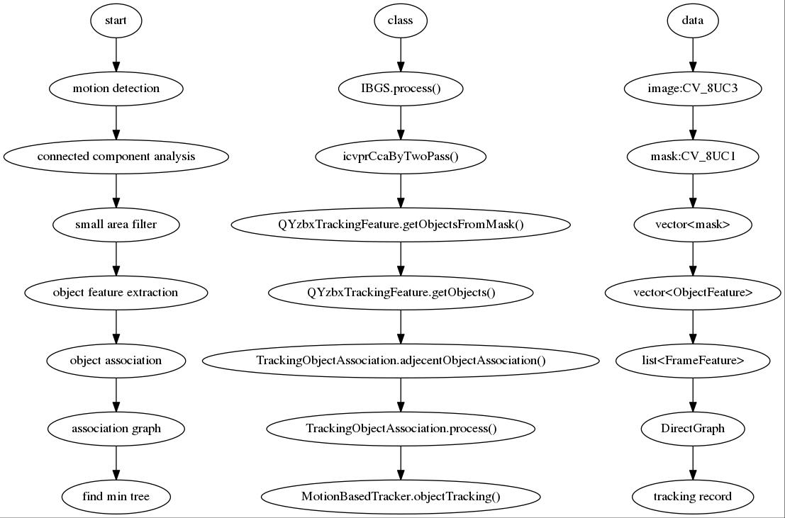
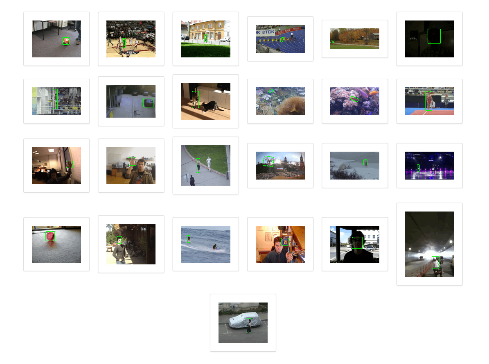

#object tracking
for multi-object tracking.

## to use dlib
```
unix: CONFIG += link_pkgconfig
unix: PKGCONFIG += dlib-1

LIBS += -L/home/yzbx/linux/miniconda2/lib -lmkl_rt
```

## motionBased
for fixed video
1. foreground detection (bgslibrary)
2. tracking (feature point, kalman)

### the gui of Motion Based Tracking

### the pipeline of Motion Based Tracking

### the result of Motion Based Tracking
- RectFloatTracker on UrbanTrackerDataset
```
*** 2D (Bounding Box overlap) ***
 Rcll  Prcn   FAR| GT  MT  PT  ML|   FP    FN  IDs   FM|  MOTA  MOTP MOTAL
 77.6  84.6  0.16| 53  35  14   4|  714  1133   38   98|  62.7  70.0  63.4

*** 2D (Bounding Box overlap) ***
 Rcll  Prcn   FAR| GT  MT  PT  ML|   FP    FN  IDs   FM|  MOTA  MOTP MOTAL
  0.6   1.8  0.41| 29   0   0  29| 3382  9357    1   26| -35.3  55.8 -35.3

*** 2D (Bounding Box overlap) ***
 Rcll  Prcn   FAR| GT  MT  PT  ML|   FP    FN  IDs   FM|  MOTA  MOTP MOTAL
 19.4  20.7  3.16| 16   2   6   8| 1958  2117    6   26| -55.3  69.1 -55.2

*** 2D (Bounding Box overlap) ***
 Rcll  Prcn   FAR| GT  MT  PT  ML|   FP    FN  IDs   FM|  MOTA  MOTP MOTAL
 11.6  13.1  0.90| 20   0   8  12| 3383  3917    5   27| -64.9  60.7 -64.8

*** 2D (Bounding Box overlap) ***
 Rcll  Prcn   FAR| GT  MT  PT  ML|   FP    FN  IDs   FM|  MOTA  MOTP MOTAL
 12.3  21.0  1.95| 28   2   6  20| 3895  7342   13  153| -34.3  63.2 -34.2
```


---

## detectionBased
for fixed and unfixed video
1. human detection or car detection (HOG)
2. tracking (level-based, energy-based)

## wonderful dataset used in project.
- [Multi-Camera Object Tracking Challenge](mct.idealtest.org/Datasets.html): fixed, non-overlapping videos.
  - [3+3+4+5=15 videos](mct.idealtest.org/Datasets.html)
  - [annotation](mct.idealtest.org/file/annotation_files.rar)
  - [evaluation](mct.idealtest.org/file/MCT_Evaluation_Kit.rar)
- [Multiple Object Tracking Benchmark 2D MOT 2015](https://motchallenge.net): fixed and unfixed, picture file.
  - [pictures and annotation](https://motchallenge.net/data/2DMOT2015.zip)
  - [evaluation](https://motchallenge.net/data/devkit.zip)
- [Visual Tracker Benchmark](cvlab.hanyang.ac.kr/tracker_benchmark): fixed and unfixed videos, single object tracking.
  - [98 videos and annotation](cvlab.hanyang.ac.kr/tracker_benchmark/datasets.html)
  - [tracker code](cvlab.hanyang.ac.kr/tracker_benchmark/v1.0/tracker_benchmark_v1.0.zip)
  - [evaluation code](cvlab.hanyang.ac.kr/tracker_benchmark/v1.0/rstEval.zip)

## github tracking project
- [edge based tracking](https://github.com/CognitiveRobotics/object_tracking_2D)
- [color based tracking](https://github.com/akaifi/MultiObjectTrackingBasedOnColor)
- [kalman based tracking](https://github.com/sariyanidi/kalman-object-tracking)
- [kernel based tracking](https://github.com/gpsinghsandhu/Kernel-Based-Object-Tracking)
- [point cloud based tracking](https://github.com/hojonathanho/tracking)
- [object tracking using multiple instance learning and particle filter](https://github.com/qqibrow/simple-object-tracking)
- [Simple, online, and realtime tracking of multiple objects in a video sequence](https://github.com/abewley/sort)
- [Online multi-object tracking - C++](https://github.com/safeng/Online_Adaptive_Multi-Object_Tracking): good, but no documence.
- [Object Tracker written in Python using dlib and OpenCV](https://github.com/bikz05/object-tracker)
- [Object Tracking For Vehicles and Pedestrians](https://github.com/youxiamotors/object-tracking)

## benchmark
- [online object tracking](http://cvlab.hanyang.ac.kr/tracker_benchmark/datasets.html): single object tracking

- [multiple object tracking](https://motchallenge.net/)

- [rgbd object tracking](http://tracking.cs.princeton.edu/)
- [various objects tracking](http://www.votchallenge.net/vot2014/dataset.html): single object tracking.



## reference
- Wu Y, Lim J, Yang M H. Online Object Tracking: A Benchmark[C]// IEEE Conference on Computer Vision & Pattern Recognition. 2013:2411-2418.
- Luo W, Xing J, Zhang X, et al. Multiple Object Tracking: A Literature Review[J]. Eprint Arxiv, 2015.
